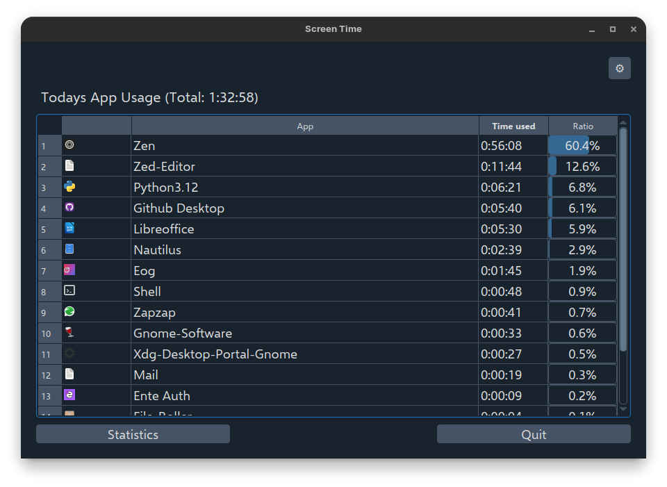
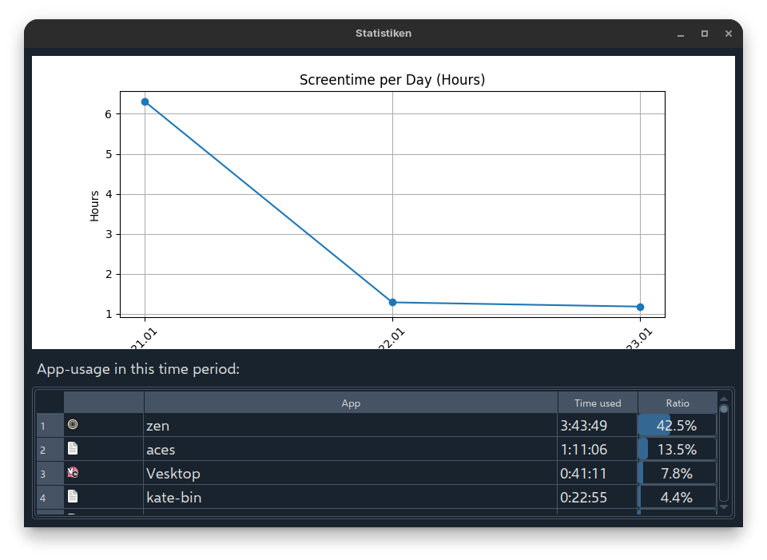

# 📊 Screentime

A lightweight, user-friendly application to monitor your PC usage on **Linux** and **Windows**. Track your screen time, and go touch Grass.

## What is Screentime?
Like the Name suggests it is a Screentime monitoring Tool, for Windows and Linux. It has useful Statistics, low resource Usage and no unneccessary Bloat. It doesnt have any branding, because i thought it would be better if it was just a simple 'default' Screentime App.



##  Features

- **📈 Real-time Monitoring** – Track active screen time as you use your computer
- **🖥️ Cross-Platform Support** – Works on Linux and Windows
- **📊 Detailed Analytics** – View Statistics on how you used your device over any period
- **⚡ Lightweight** – Minimal resource consumption, runs smoothly in the background
- **🎨 User-Friendly Interface** – Simple and intuitive design
- **🔄 Automatic Tracking** – Set it up once and it just works 'out of the Box'

## Getting Started

### Prerequisites
- Python 3.7 or higher
- Linux or Windows operating system

### Installation

1. Clone the repository:
```bash
git clone https://github.com/truelockmc/Screentime.git
cd Screentime
```

2. Install dependencies:
```bash
pip install -r requirements.txt
```

3. Run the application:
```bash
python main.py
```

## Usage

Simply start the application and it will begin monitoring your screen time automatically. Your usage data will be displayed in an easy-to-understand format. <br> </br>
By default the Application runs itself on startup, you can change this in the Settings.

## Testing
This Program has been tested to work best on Linux with GNOME as this is the System i am using.
It has also been tested to work on XFCE and Windows, but the App Names are not recognized as good sometimes.
### It does only work on x11 right now, Wayland support is on the Way [more](https://github.com/truelockmc/Screentime/issues/7)

## 📝 License

This project is licensed under the GNU General Public License v3.0 – see the [LICENSE](LICENSE) file for details.

## 🤝 Contributing

Contributions are welcome! Feel free to open an issue or submit a pull request to help improve Screentime.

## 💬 Questions or Issues?

Have a question or found a bug? [Open an issue](https://github.com/truelockmc/Screentime/issues) and let me know!

---

**Made with ❤️ by [truelockmc](https://github.com/truelockmc)**
